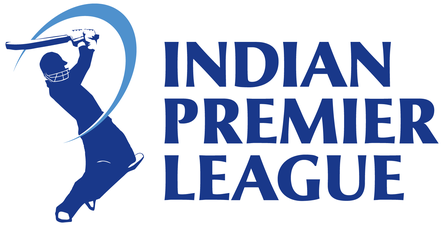
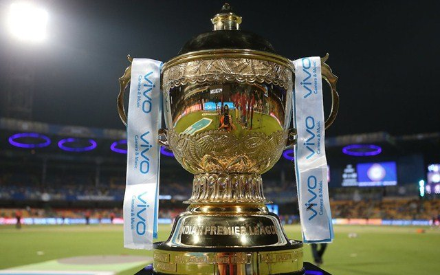
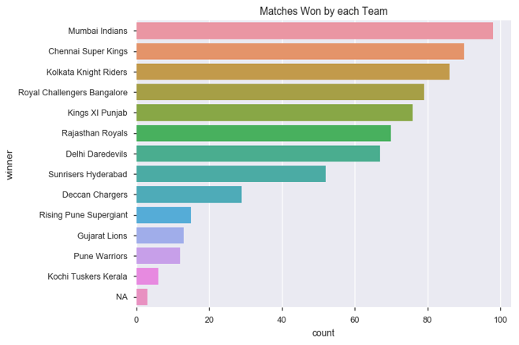
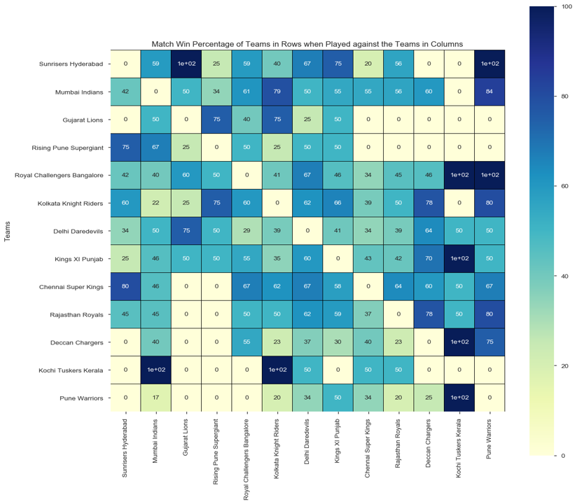
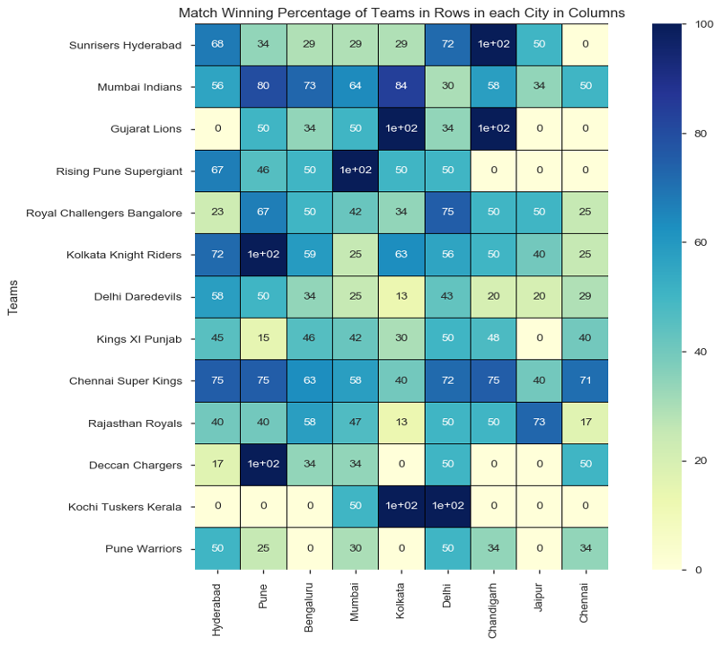

# Indian_Premier_League-Exploratory_Data_Analysis

## INTRODUCTION
The __Indian Premier League (IPL)__ is a professional __Twenty20__ cricket league in India contested during April and May of every year by teams representing 8 Indian cities and some states. The league was founded by the __Board of Control for Cricket in India (BCCI)__ in __2008__. 

The IPL is the most-attended cricket league in the world and in 2014 ranked sixth by average attendance among all sports leagues. In 2010, the IPL became the first sporting event in the world to be broadcast live on __YouTube__. The brand value of IPL in 2018 was USD 6.3 billion, according to __Duff & Phelps__. According to BCCI, the 2015 IPL season contributed ₹11.5 billion (USD 182 million) to the GDP of the Indian economy. 

There have been __eleven seasons__ of the IPL tournament till 2018.

Currently, with eight teams, each team plays each other twice in a home-and-away round-robin format in the league phase. At the conclusion of the league stage, the top four teams will qualify for the playoffs. The top two teams from the league phase will play against each other in the first Qualifying match, with the winner going straight to the IPL final and the loser getting another chance to qualify for the IPL final by playing the second Qualifying match. Meanwhile, the third and fourth place teams from league phase play against each other in an eliminator match and the winner from that match will play the loser from the first Qualifying match. The winner of the second Qualifying match will move onto the final to play the winner of the first Qualifying match in the IPL Final match, where the winner will be crowned the Indian Premier League champions.

## PROBLEM STATEMENT
__matches.csv__ dataset contains the various details of the __Indian Premier League (IPL)__ matches over its __11 seasons__.
The primary aim of this __Project__ is to __find out how the Match Winning Percentage of a Team is varying with respect to the various parameters with the help of the data present in the dataset__.

For the purpose of this Project my Assumption is: 
__ASSUMPTION : I am an Analyst from Mumbai Indians Team__

So, I will be presenting my __observations & conclusions__ from the __perspective of Mumbai Indians Team's Analyst__.

## DATA
- The dataset consists of the information about __Indian Premier League (IPL)__ matches over its 11 seasons. Various variables present in the dataset includes data of season, city, player of match etc. 
- The dataset comprises of __696 observations of 18 columns__. Below is a table showing names of all the columns and their description.

| Column Name | Description |
| --- | --- | 
| Id              | Match Identity                                            | 
| Season          | Year of the Tournament                                    |  
| City            | City in which the match was played                        | 
| Date            | Date on which the match was played                        |   
| Team1           | Name of the first team                                    |
| Team2           | Name of the second team                                   |
| Toss_Winner     | Name of the team that won the coin toss                   |
| Toss_Decision   | Decision taken by the toss winner                         |
| Result          | Whether the result of the match was a tie or normal       |
| DL_Applied      | Whether Duckworth-Lewis Method was applied in the match   |
| Winner          | Name of the Team that won the match                       |
| Win_by_Runs     | The winner of the match won by how many runs              |
| Win_by_Wickets  | The winner of the match won by how many wickets           |
| Player_of_Match | Name of the Player whose performance was outstanding      |
| Venue           | Name of the Stadium where the match was played            |
| Umpire1         | Name of the first field umpire                            |
| Umpire2         | Name of the second field umpire                           |
| Umpire3         | Name of the off-field TV umpire                           |

## EXPLORATORY DATA ANALYSIS
| Target Analysis | Finding |
| --- | --- |
| Season Wise Winners & Runners-Up   |       |
| Matches Won by Each Team           |     | 
| Team Win Chance Against Other Teams|  | 
| Team Win Chance Location Wise      | |

- [Jupyter Notebook](./IPL_EDA_Notebook.ipynb)
- [IPL EDA Presentation](./IPL-EDA-Presentation.pptx)
- [IPL EDA Video Presentation](./IPL-EDA-Video-Presentation.mp4)
