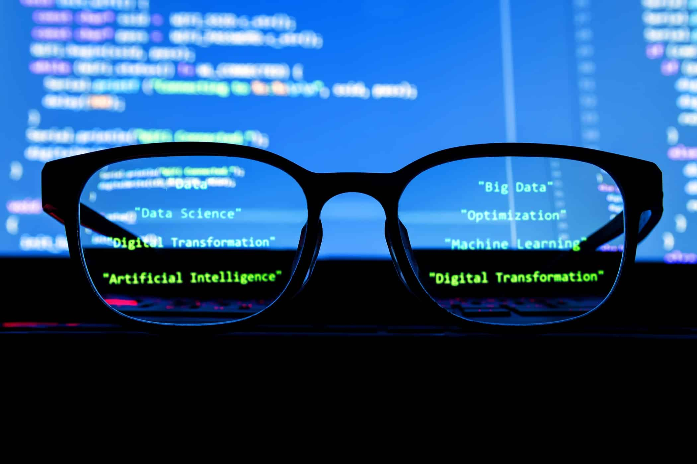
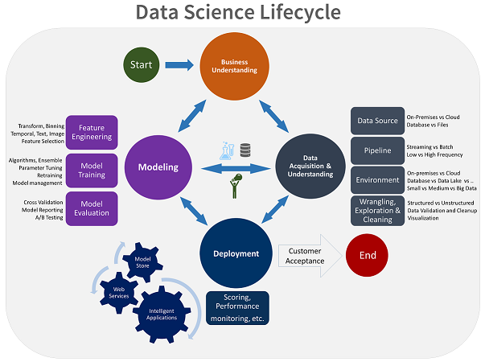
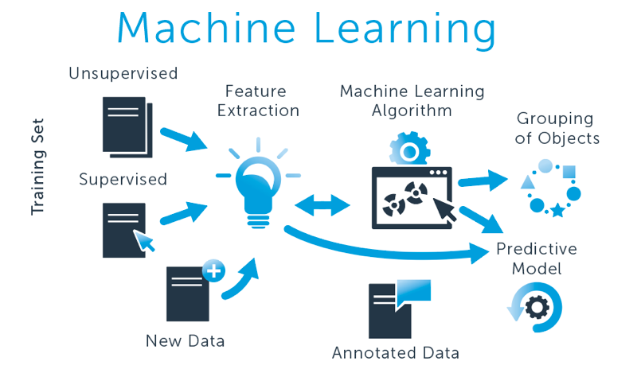
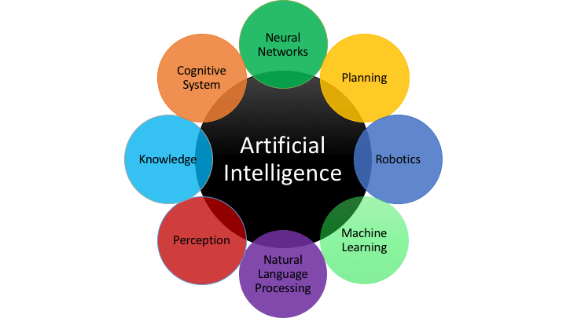
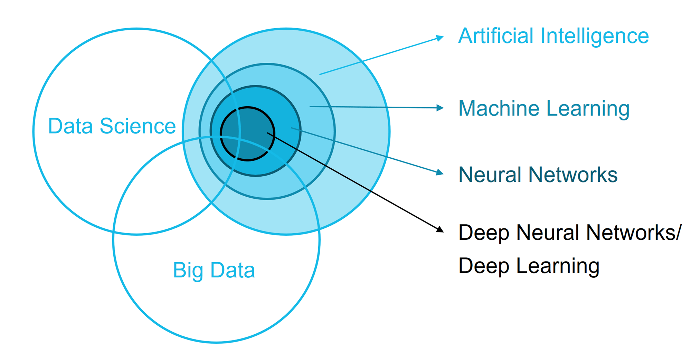

# INSAID DS-ML-AI Projects

Modern technologies like __artificial intelligence, machine learning, data science__ and __big data__ have become the __buzzwords__ which everybody talks about off late. They seem very complex to a layman and people often get confused by words like AI, ML and data science. So, let's see what are these.

__What is Data Science?__

Data science is the extraction of relevant insights from data. It uses various techniques from many fields like __mathematics, machine learning, computer programming, statistical modeling, data engineering and visualization, pattern recognition and learning, uncertainty modeling, data warehousing, and cloud computing__.

Data science is the most widely used technique among AI, ML and itself. The practitioners of data science are usually skilled in mathematics, statistics, and programming (although expertise in all three is not required). Data scientists solve complex data problems to bring out insights and correlation relevant to a business.

__What is Machine Learning?__

Machine learning is the ability of a computer system to learn from the environment and improve itself from experience without the need for any explicit programming. Machine learning focuses on enabling algorithms to learn from the data provided, gather insights and make predictions on previously unanalyzed data using the information gathered. Machine learning can be performed using multiple approaches. The three basic models of machine learning are supervised, unsupervised and reinforcement learning.

Machine learning algorithms are used in a wide variety of applications, such as __email filtering, computer vision, credit-card fraud detection, recommendation engines, sentiment analysis,__ etc.

__What is Artificial Intelligence (AI)?__

Artificial intelligence refers to the simulation of a human brain function by machines. This is achieved by creating an artificial neural network that can show human intelligence. The primary human functions that an AI machine performs include logical reasoning, learning and self-correction. Artificial intelligence is a wide field with many applications but it also one of the most complicated technology to work on. Machines inherently are not smart and to make them so, we need a lot of computing power and data to empower them to simulate human thinking.

__The Difference between Artificial Intelligence, Machine Learning and Data Science:__

Artificial intelligence is a very wide term with applications ranging from robotics to text analysis. It is still a technology under evolution. Machine learning is a subset of AI that focuses on a narrow range of activities. It is, in fact, the only real artificial intelligence with some applications in real-world problems.

Data science isn’t exactly a subset of machine learning but it uses ML to analyze data and make predictions about the future. It combines machine learning with other disciplines like big data analytics and cloud computing. Data science is a practical application of machine learning with a complete focus on solving real-world problems.

## REPOSITORY OVERVIEW
This repository is about different Data Science, Machine Learning & Artificial Intelligence algorithm approaches as per the industry practices.

## TABLE OF CONTENTS
- [Indian Premier League - Exploratory Data Analysis](#section1) 
- [House Sale Price Prediction](#section2) 

___

### [Indian Premier League - Exploratory Data Analysis](./Indian_Premier_League-Exploratory_Data_Analysis)

- The __Indian Premier League (IPL)__ is a professional __Twenty20__ cricket league in India contested during April and May of every year by teams representing 8 Indian cities and some states.
- __Chennai Super Kings(CSK)__ and __Mumbai Indians(MI)__ are the most successful teams.
- The primary aim of this __Project__ is to __find out how the Match Winning Percentage of a Team is varying with respect to the various parameters with the help of the data present in the dataset__.
- [Link for the Jupyter notebook](./Indian_Premier_League-Exploratory_Data_Analysis/IPL_EDA_Notebook.ipynb)

___

### [House Sale Price Prediction](./House_SalePrice_Prediction)

- Our goal for this project is to use __Machine Learning Regression Technique__ in order to estimate the __SalePrice (in dollars) for a particular house as a function of 81 explanatory variables describing (almost) every aspect of a house.__
- We want to find a function that given input data for these 81 explanatory variables predicts the SalePrice of a house.
- Which feature contribute to *saleprice*?
- Visualize the relationship between the *features* and the *response*.
- [Link for the Jupyter notebook](./House_SalePrice_Prediction/HousePricePrediction.ipynb)

___
